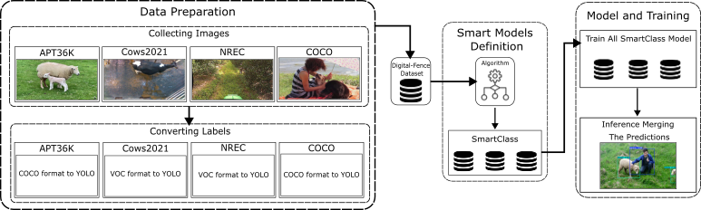

# Digital Fencing for Farms: Enhancing Object Detection through Multi-Dataset Integration

Welcome to the repository for our paper “Digital Fencing for Farms: Enhancing Object Detection through Multi-Dataset Integration”, accepted at XIX Workshop de Visão Computacional (WVC), 2024.

[]

If you find this work useful for your research, please cite our paper:

```bibtex
@inproceedings{Ferreira2024,
    title        = {Digital Fencing for Farms: Enhancing Object Detection through Multi-Dataset Integration},
    author       = {Ferreira, Juliana Quintiliano and Silva, Lucas and Gomes, Thiago L. and Silva, Michel Melo},
    year         = 2024,
    booktitle    = {Proceedings of the XIX Workshop de Visão Computacional (WVC)},
    organization = {WVC},
    url          = {http://urlib.net/ibi/8JMKD3MGPEW34M/4BU46CP}
}

```