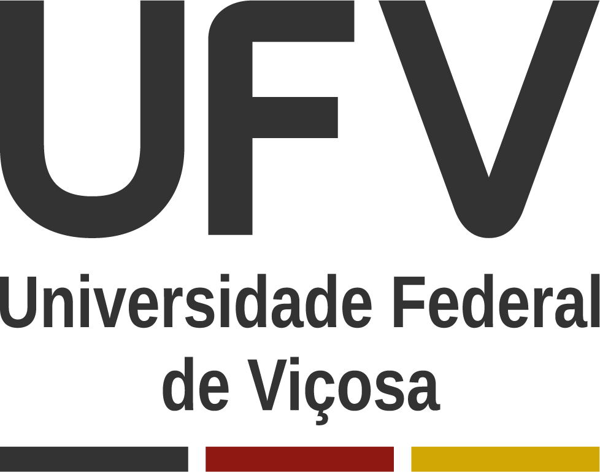

# Digital Fencing for Farms: Enhancing Object Detection through Multi-Dataset Integration

| [Paper](https://doi.org/10.22456/2175-2745.143486) | 
| -------------------------------------------------- |

Welcome to the repository for our paper “Digital Fencing for Farms: Enhancing Object Detection through Multi-Dataset Integration”, accepted at XIX Workshop de Visão Computacional (WVC), 2024.

[]

> Overview of our method, which is divided into three steps. The first step involves data preparation, where image datasets are selected, and their annotations are converted to a unified format (YOLO format). These images and annotations are then merged into a single dataset. In the second step, subsets of data and classes (SmartClass) are created to ensure consistent class annotations. Finally, in the third step, models are trained using the YOLOv8 architecture with transfer learning.

If you find this work useful for your research, please cite our paper:

```bibtex
@inproceedings{Ferreira2024,
    title        = {Digital Fencing for Farms: Enhancing Object Detection through Multi-Dataset Integration},
    author       = {Ferreira, Juliana Quintiliano and Silva, Lucas and Gomes, Thiago L. and Silva, Michel Melo},
    year         = 2024,
    booktitle    = {Proceedings of the XIX Workshop de Visão Computacional (WVC)},
    organization = {WVC},
    url          = {}
}

```
## Create Digital-Fence-Dataset

You can create the Digital-Fence-Dataset used in our article by following the steps:

- Download the APT36k dataset from: https://github.com/pandorgan/APT-36K

- Download the NREC dataset from: https://www.nrec.ri.cmu.edu/solutions/agriculture/other-agriculture-projects/human-detection-and-tracking.html

- Download the COWS2021 dataset from: https://github.com/Wormgit/Cows2021

- Download the COCO dataset from: https://cocodataset.org/#home

After downloading all the datasets, run the annotation conversion algorithms, available in this repository, for each one.
- convert_apt36k_coco_to_yolo.py
- convert_nrec_voc_to_yolo.py
- convert_cows2021_voc_to_yolo.py
- convert_coco_to_yolo.py

## Create SmartClass models

Run the create_smartClass.py algorithm to create the dataset for each SmartClass model. Note that within each SmartClass dataset there will be a txt file informing the classes of this SmartClass. Then, perform a training and validation split on the dataset and train each SmartClass separately.

To train the models, use train_exemple.py and smartClass_exemple.yaml. Create the yaml according to the txt file generated inside the folder of each SmartClass dataset.

## Weights

Our weights are available in this repository in the folders weights_model_1, weights_model_2 and weights_smartClass.

If you want to do inference by merging SmartClass predictions, use the code predict_SmartClass_models.py.

## Contact

### Authors

| [Juliana Quintiliano Ferreira](https://github.com/JulianaQuintiliano) | [Lucas Silva](https://github.com/Lucas-silva23) | [Thiago L. Gomes](https://github.com/thiagoluange) | [Michel Melo Silva](https://michelmelosilva.github.io/) |
| :---------------------------------------------------------------: | :------------------------------------------: | :-----------------------------------------------: | :--------------------------------------------------: |
|                              MSc. Student¹                        |                 BSc. Student¹                |                Assistant Professor¹               |                Assistant Professor¹                   |
|               <juliana.q.ferreira@ufv.br>                         |           <lucas.silva23@ufv.br>             |           <thiago.luange@ufv.br>                  |           <michel.m.silva@ufv.br>                    |

¹Universidade Federal de Viçosa  
Departamento de Informática  
Viçosa, Minas Gerais, Brazil


### Laboratory

| [](https://mavilab-ufv.github.io/) | [](https://www.ufv.br/) |
| --------------------------------------------------------------------------------------------------------------------------------------------------------------------------- | ------------------------------------------------------------------- |

**MaVILab**: Machine Vision and Intelligence Laboratory \
 <https://mavilab-ufv.github.io>

## Acknowledgements

We would like to thank CAPES, CNPq and FAPEMIG, for supporting this project.